# Deep Dual Consecutive Network for Human Pose Estimation （CVPR2021）
## Introduction

This is the official code of **Deep Dual Consecutive Network for Human Pose Estimation.**

Multi-frame human pose estimation in complicated situations is challenging. Although state-of-the-art human joints detectors have demonstrated remarkable results for static images, their performances come short when we apply these models to video sequences. Prevalent shortcomings include the failure to handle motion blur, video defocus, or pose occlusions, arising from the inability in capturing the temporal dependency among video frames. On the other hand, directly employing conventional recurrent neural networks incurs empirical difficulties in modeling spatial contexts, especially for dealing with pose occlusions. In this paper, we propose a novel multi-frame human pose estimation framework, leveraging abundant temporal cues between video frames to facilitate keypoint detection. Three modular components are designed in our framework. A Pose Temporal Merger encodes keypoint spatiotemporal context to generate effective searching scopes while a Pose Residual Fusion module computes weighted pose residuals in dual directions. These are then processed via our Pose Correction Network for efficient refining of pose estimations. Our method ranks No.1 in the Multi-frame Person Pose Estimation Challenge on the large-scale benchmark datasets PoseTrack2017 and PoseTrack2018. We have released our code, hoping to inspire future research.


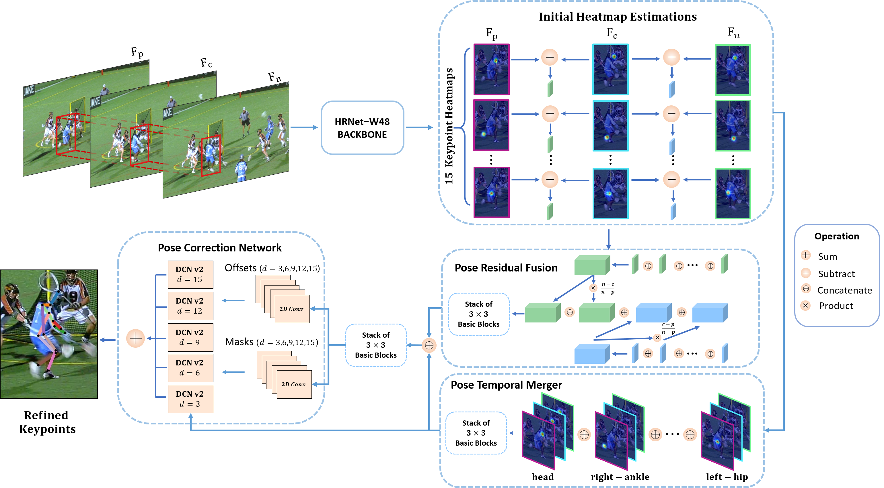


## Visual Results

 <video id="video" controls="" preload="none">     <source id="mp4" src="docs/DCPoseShow.mp4" type="video/mp4"> </video>

#### On PoseTrack


<p align='center'>
	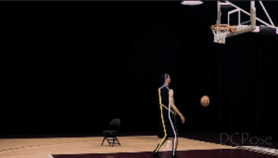
	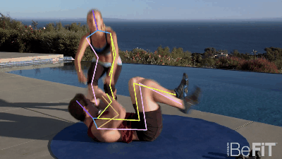
</p>
<p align='center'>
	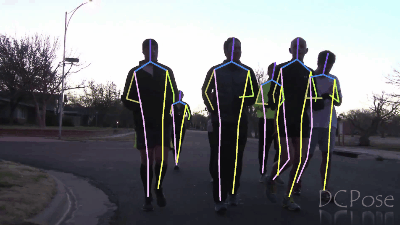
	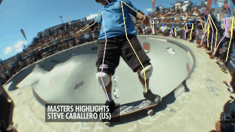
</p>
<p align='center'>
	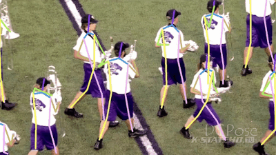
	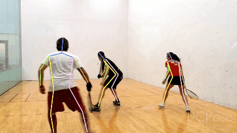
</p>

<p align='center'>
	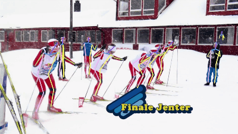
	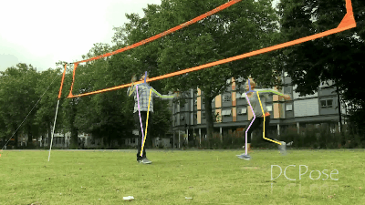
</p>


#### Comparison with SOTA method

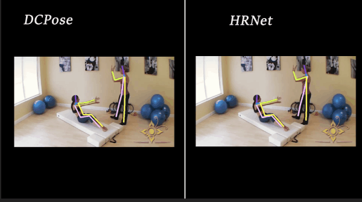

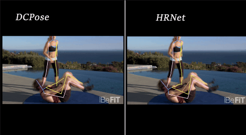


## Experiments


#### Results on PoseTrack 2017 validation set

| Method                        | Head | Shoulder | Elbow | Wrist | Hip  | Knee | Ankle | Mean |
| ----------------------------- | ---- | -------- | ----- | ----- | ---- | ---- | ----- | ---- |
| **PoseFlow**                  | 66.7 | 73.3     | 68.3  | 61.1  | 67.5 | 67.0 | 61.3  | 66.5 |
| **JointFlow**                 | -    | -        | -     | -     | -    | -    | -     | 69.3 |
| **FastPose**                  | 80.0 | 80.3     | 69.5  | 59.1  | 71.4 | 67.5 | 59.4  | 70.3 |
| **SimpleBaseline**(2018 ECCV) | 81.7 | 83.4     | 80.0  | 72.4  | 75.3 | 74.8 | 67.1  | 76.7 |
| **STEmbedding**               | 83.8 | 81.6     | 77.1  | 70.0  | 77.4 | 74.5 | 70.8  | 77.0 |
| **HRNet**(2019 CVPR)          | 82.1 | 83.6     | 80.4  | 73.3  | 75.5 | 75.3 | 68.5  | 77.3 |
| **MDPN**                      | 85.2 | 88.8     | 83.9  | 77.5  | 79.0 | 77.0 | 71.4  | 80.7 |
| **PoseWarper**(2019 NIPS)     | 81.4 | 88.3     | 83.9  | 78.0  | 82.4 | 80.5 | 73.6  | 81.2 |
| **DCPose**                    | 88.0 | 88.7     | 84.1  | 78.4  | 83.0 | 81.4 | 74.2  | 82.8 |


#### Results on PoseTrack 2017 test set(https://posetrack.net/leaderboard.php)

| Method         | Head | Shoulder | Elbow | Wrist | Hip  | Knee | Ankle | Total |
| -------------- | ---- | -------- | ----- | ----- | ---- | ---- | ----- | ----- |
| PoseFlow       | 64.9 | 67.5     | 65.0  | 59.0  | 62.5 | 62.8 | 57.9  | 63.0  |
| JointFlow      | -    | -        | -     | 53.1  | -    | -    | 50.4  | 63.4  |
| KeyTrack       | -    | -        | -     | 71.9  | -    | -    | 65.0  | 74.0  |
| DetTrack       | -    | -        | -     | 69.8  | -    | -    | 65.9  | 74.1  |
| SimpleBaseline | 80.1 | 80.2     | 76.9  | 71.5  | 72.5 | 72.4 | 65.7  | 74.6  |
| HRNet          | 80.0 | 80.2     | 76.9  | 72.0  | 73.4 | 72.5 | 67.0  | 74.9  |
| PoseWarper     | 79.5 | 84.3     | 80.1  | 75.8  | 77.6 | 76.8 | 70.8  | 77.9  |
| DCPose         | 84.3 | 84.9     | 80.5  | 76.1  | 77.9 | 77.1 | 71.2  | 79.2  |


#### Results on PoseTrack 2018 validation set

| Method     | Head | Shoulder | Elbow | Wrist | Hip  | Knee | Ankle | Mean |
| ---------- | ---- | -------- | ----- | ----- | ---- | ---- | ----- | ---- |
| AlphaPose  | 63.9 | 78.7     | 77.4  | 71.0  | 73.7 | 73.0 | 69.7  | 71.9 |
| MDPN       | 75.4 | 81.2     | 79.0  | 74.1  | 72.4 | 73.0 | 69.9  | 75.0 |
| PoseWarper | 79.9 | 86.3     | 82.4  | 77.5  | 79.8 | 78.8 | 73.2  | 79.7 |
| DCPose     | 84.0 | 86.6     | 82.7  | 78.0  | 80.4 | 79.3 | 73.8  | 80.9 |


#### Results on PoseTrack 2018 test set

| Method      | Head | Shoulder | Elbow | Wrist | Hip  | Knee | Ankle | Mean |
| ----------- | ---- | -------- | ----- | ----- | ---- | ---- | ----- | ---- |
| AlphaPose++ | -    | -        | -     | 66.2  | -    | -    | 65.0  | 67.6 |
| DetTrack    | -    | -        | -     | 69.8  | -    | -    | 67.1  | 73.5 |
| MDPN        | -    | -        | -     | 74.5  | -    | -    | 69.0  | 76.4 |
| PoseWarper  | 78.9 | 84.4     | 80.9  | 76.8  | 75.6 | 77.5 | 71.8  | 78.0 |
| DCPose      | 82.8 | 84.0     | 80.8  | 77.2  | 76.1 | 77.6 | 72.3  | 79.0 |


## Installation & Quick Start

**Check** [docs/installation.md](docs/Installation.md) for instructions on how to build DCPose from source.

# Citation
```
@InProceedings{Liu_2021_CVPR,
    author    = {Liu, Zhenguang and Chen, Haoming and Feng, Runyang and Wu, Shuang and Ji, Shouling and Yang, Bailin and Wang, Xun},
    title     = {Deep Dual Consecutive Network for Human Pose Estimation},
    booktitle = {Proceedings of the IEEE/CVF Conference on Computer Vision and Pattern Recognition (CVPR)},
    month     = {June},
    year      = {2021},
    pages     = {525-534}
}
```
